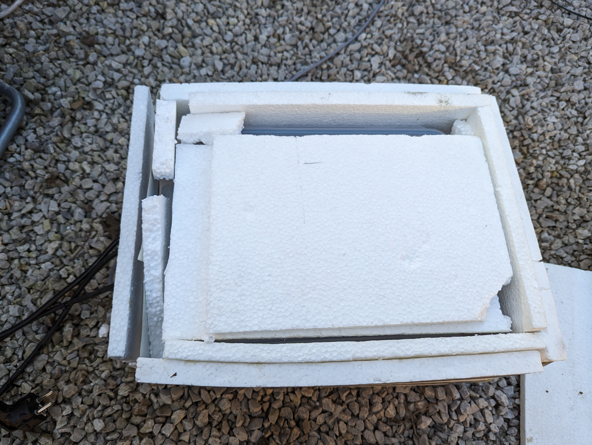
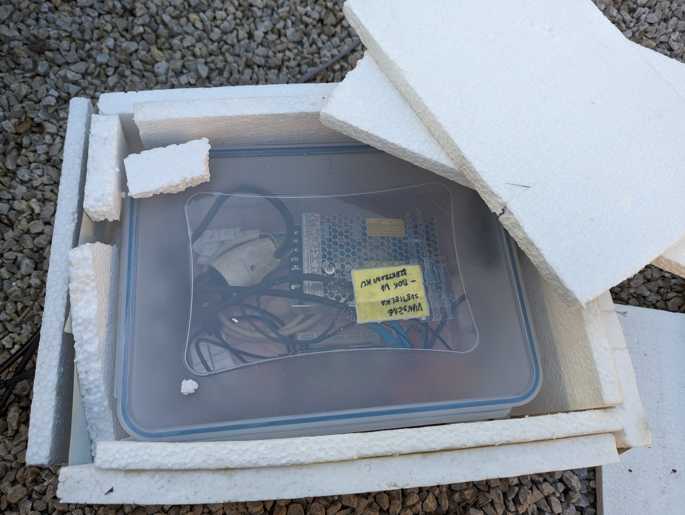
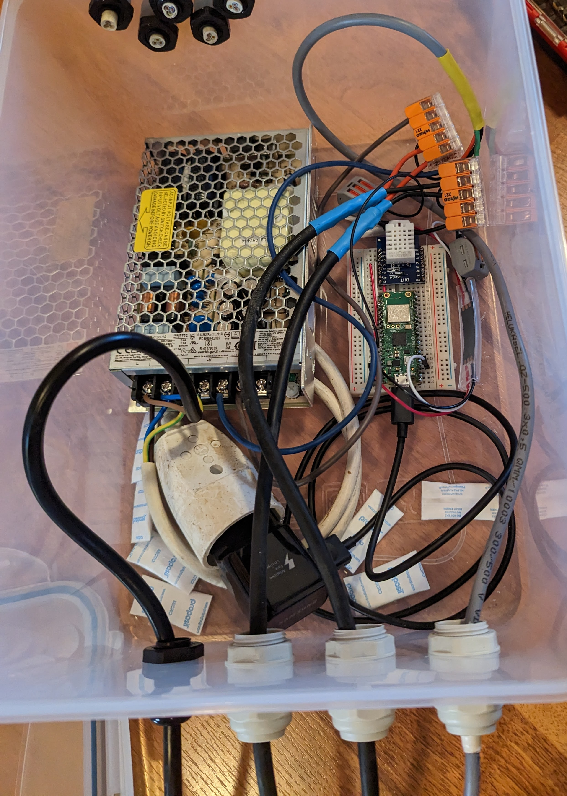

# Wiring

Everything is inside large tupperware container with cable glands. Throw in a few sillica gel bags for good measure.

Has to be well insulated - double-stacked polystyrene sheets all around and on top, with an extra thick piece at the bottom. Make sure there is very little empty space inside to prevent airflow. Cover the whole thing with plastic sheet to deflect rain and wind.

|  |  |  |
| ----------------------------- | ----------------------------- | ----------------------------- |

External cables:

- Power cord (240V)
- Power+Data for lights
- 2x extra power injection for lights

Internal components:

- Meanwell LRS-150-12: 12V 150W PSU
- Power plug for 5V USB power supply (for Pico)
- Breadboard with RPi Pico W and DHT22 sensor
- Bunch of Wago connectors to join things together

Internal wiring:

- Power:
  - External power cord -> Live/Neutral/Earth to the PSU input
  - Power plug -> also Live/Neutral/Earth of the PSU
  - 12V output of PSU -> Wago -> power lines of the light cables (3x)
  - USB charger in power plug -> USB cable to Pico
  - Ground pin of Pico -> negative output of PSU (via Wago) to tie grounds toger
- Signal
  - Pico -> DHT signal
  - Light drive pin -> Offcut WS281x pixel -> Output data cable

The offcut single pixel serves as logic convertor (pico 3v3 -> 5v) and signal conditioning. Tried to use level shifter before but it was glitching.

