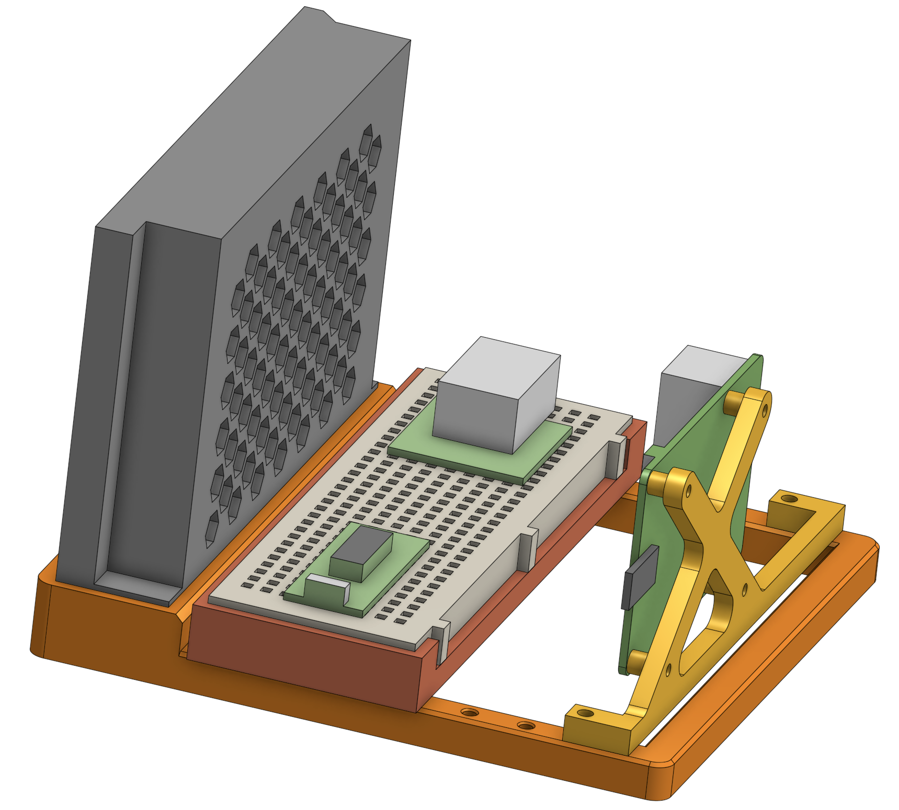
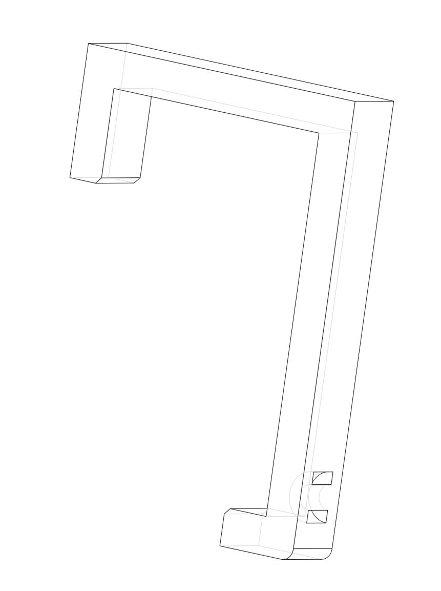

# Models for 3D printing

## Electronics box organization

Three separate pieces for ease of printing and flexibility of replacement. Print one of each.

* Base plate to which everything attaches.
* Mounting plate for a breadboard.
* Mounting plate for a Raspberry Pi.

Secure the Meanwell LRS-150-12 PSU to the base plate with three M3 screws. Add two M3 heatset-inserts to each mounting plate and secure it to the base plate with two M3 screws. Also use four M2 screws and heatset-inserts to secure the RPi to its mounting plate.

*(Base plate and mounting plates in shades of red/yellow/orange. PSU, breadboard, RPi, RPi Pico and DHT22 are off the shelf parts.)*

## Fence clip

Snap-in fence clips with zip-tie channel to secure the light string. Print 3x11 = 33 pieces + extras for breakage during install.

