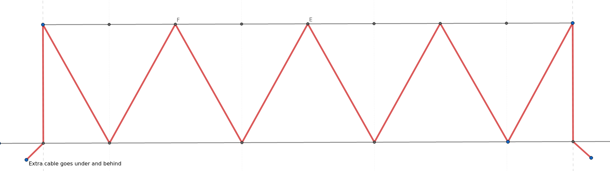

# Mounting

Three strings of 100 leds, ~10m each. Mounted on three fence sections, each with 80 leds, roughly centered on the string. The ~10 extra leds / ~1m of cable extra on each side is used to connect strings together and add power injection.

Attached to fence via 3d printed cable clips: See [models](../models/README.md). Need 11 clips per fence, 5 on top, 6 on the bottom. Place the clips like in the diagram, then use zipties to secure the lights, with 10 leds between every two clips.

One cable has the connector installed backwards, use <https://www.printables.com/model/322266-cable-wrap-for-waterpoof-3pin-ws2811-light-cable> to make it water-tight.
