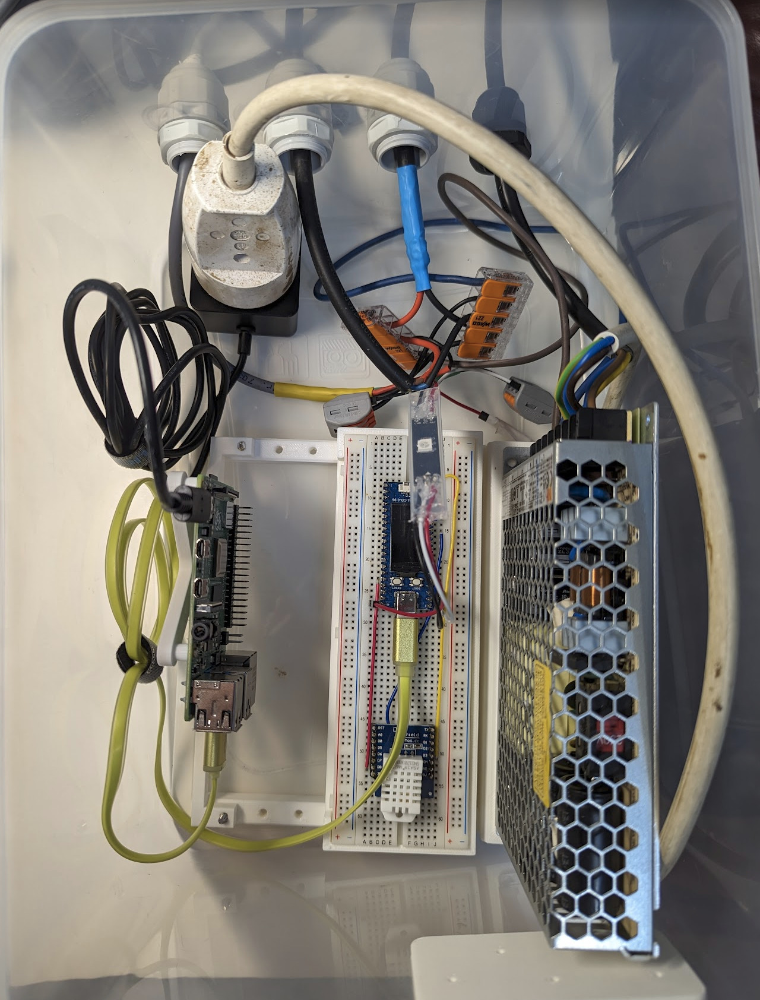

# Wiring

Everything is inside large tupperware container with cable glands. Throw in a few sillica gel bags for good measure.

Has to be well insulated - double-stacked polystyrene sheets all around and on top, with an extra thick piece at the bottom. Make sure there is very little empty space inside to prevent airflow. Cover the whole thing with plastic sheet to deflect rain and wind.

(TODO more pictures from outside install)

External cables:

- Power cord (240V).
- Power+Data for lights.
- 2x extra power injection for lights.

Internal components:

- Meanwell LRS-150-12: 12V 150W PSU.
- Breadboard with RPi Pico (well, waveshare RP2040-LCD-0.96 actually, but those are compatible) and DHT22 sensor.
- Raspberry Pi 4B, connected to the RP2040 via USB for power and data.
- Power plug + USB power supply for the RPi 4B.
- Bunch of Wago connectors to join things together.

Internal wiring:

- Power:
  - External power cord -> Live/Neutral/Earth to the PSU input
  - Power plug -> also Live/Neutral/Earth of the PSU
  - 12V output of PSU -> Wago -> power lines of the light cables (3x)
  - USB charger in power plug -> USB cable to RPi 4B
  - Ground pin of RP2040 -> negative output of PSU (via Wago) to tie grounds toger
- Signal
  - RP2040 -> DHT signal
  - Light drive pin -> Offcut WS281x pixel -> Output data cable

The offcut single pixel serves as logic convertor (RP2040 3v3 -> 5v) and signal conditioning. Tried to use level shifter before but it was glitching.

(TODO wiring diagram)

